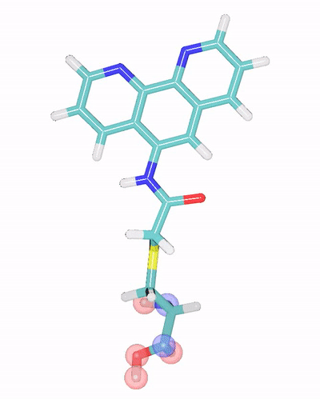

.. _Charmm format:

Covalent modifications with CHARMM parameters
=============================================

.. contents:: :local:

In this tutorial, we will prepare to set up a simulation of murine adipocyte
lipid-binding protein (ALBP) with a covalently attached phenanthroline, from
PDB ID `1A18 <https://rcsb.org/structure/1A18>`_, using the Charmm36 forcefield
and Dabble.

You should be familiar with preparing a basic protein-ligand system, and how to
parameterize a ligand using ParamChem before starting this tutorial, but don't
have to be an expert. This tutorial is written from the perspective of a
typical researcher, and will go through a few debugging strategies when
problems are encountered.

Answer the questions in **bold** as you go through the tutorial.
.. TODO bold more questions

.. note::

   In order to be maximally accessible, this tutorial avoids the use of
   proprietary software that requires a license or fee. If you have access to
   programs like Schrodinger's Maestro, a lot of the steps become much simpler.
   Feel free to accomplish tasks like editing molecules with any software
   you prefer, as long as you carefully check the results are what you expect.

Introduction
------------

ALBP is a good scaffold for exploring steroselective reactions, and the PDB
structure has an attached covalent modification that can perform catalysis. In
order to simulate the protein, we'll have to derive parameters for the NPH
residue.

Download `the structure <https://files.rcsb.org/download/1A18.pdb>`_ and open
it in VMD. Look at the NPH residue. It's a covalently modified cysteine. Let's
first think about how amino acids are represented in CHARMM, before building
parameters for the NPH residue.

Amino acids
~~~~~~~~~~~
CHARMM topology files usually end in ``.rtf``, and contain multiple residue
definitions. All of the topology files that Dabble uses can be found in `the
source directory
<https://github.com/Eigenstate/dabble/tree/master/dabble/param/parameters>`_.

.. note::

   Don't hesitate to poke around in text files that contain information your
   simulation programs use. They're far easier to understand than you might
   think, and you can learn a lot about how molecular systems can be represented
   in a computer.

Definitions of protein-related residues are in ``top_all36_prot.rtf``. Let's
open it up.

After scrolling by some comments (lines beginning with ``!``), definitions of
atom types (starting with ``MASS``), declarations of extraresidue atoms
(starting with ``DECL``), and CHARMM-related housekeeping (starting with
``DEFA`` or ``AUTO``), we get to the first residue topology template, starting
with ``RESI``. It's alanine! Here are the relevant parts of the residue
definition::

   RESI ALA          0.00
   GROUP
   ATOM N    NH1    -0.47  !     |
   ATOM HN   H       0.31  !  HN-N
   ATOM CA   CT1     0.07  !     |     HB1
   ATOM HA   HB1     0.09  !     |    /
   GROUP                   !  HA-CA--CB-HB2
   ATOM CB   CT3    -0.27  !     |    \ 
   ATOM HB1  HA3     0.09  !     |     HB3
   ATOM HB2  HA3     0.09  !   O=C
   ATOM HB3  HA3     0.09  !     |
   GROUP                   !
   ATOM C    C       0.51
   ATOM O    O      -0.51
   BOND CB CA  N  HN  N  CA
   BOND C  CA  C  +N  CA HA  CB HB1  CB HB2  CB HB3
   DOUBLE O  C
   IMPR N -C CA HN  C CA +N O
   CMAP -C  N  CA  C   N  CA  C  +N

A helpful ASCII art shows how all of the atoms are arranged, by name.  Each
``ATOM`` line contains the atom *name*, *type*, and *partial charge*.  ``BOND``
lines list pairs of atoms that are bonded to each other.  ``DOUBLE`` lines list
pairs of atoms that are double bonded to each other (although the concept of a
double bond is not necessary for most MD simulations). There are two improper
terms defined on the ``IMPR`` line, and one ``CMAP`` term.

Other information about this residue, such as ``GROUP``, ``DONOR``,
``ACCEPTOR`` and internal coordinate ``IC`` lines aren't necessary for our
work today. Groups are used to track partial charges, and internal
coordinates used to assign locations for missing atoms. Donor and acceptor is
used for some types of calculation in CHARMM, but are not necessary for running
traditional MD simulation with the CHARMM forcefield.

One thing you might notice about this definition is that some atoms listed in
the bonded terms (bonds, impropers, cmaps, etc) are not present in the ASCII
art. The ``+N`` and ``-C`` atoms are *extraresidue atoms,* that is, atoms that
are present on the residues to which this one is bonded. In this case, the
atoms are the connections to the next and previous amino acids in the chain.

Frustratingly in CHARMM, bonds to these extraresidue atoms are not required to
be explicitly defined. A ``C +N`` bond is defined, but the ``-C N`` bond on
the other side is implicitly defined by the CMAP term. Keep this in mind when
reading CHARMM topology files.

Patches
~~~~~~~
CHARMM handles covalent modifications by applying patches to template
topologies. A *patch* is a list of modifications to a residue, and possibly
additional parameters, that will produce a new residue. Patches are defined
in CHARMM topology files with the ``PRES`` directive.

Here is serine, with unnecessary lines removed for clarity::

   RESI SER          0.00
   ATOM N    NH1    -0.47  !     |
   ATOM HN   H       0.31  !  HN-N   HB1
   ATOM CA   CT1     0.07  !     |   |
   ATOM HA   HB1     0.09  !  HA-CA--CB--OG
   ATOM CB   CT2     0.05  !     |   |     \ 
   ATOM HB1  HA2     0.09  !     |   HB2    HG1
   ATOM HB2  HA2     0.09  !   O=C
   ATOM OG   OH1    -0.66  !     |
   ATOM HG1  H       0.43
   ATOM C    C       0.51
   ATOM O    O      -0.51
   BOND CB CA   OG CB  N HN  N  CA
   BOND C  CA  C +N  CA HA  CB HB1
   BOND CB HB2  OG HG1
   DOUBLE   O  C
   IMPR N -C CA HN  C CA +N O
   CMAP -C  N  CA  C   N  CA  C  +N

The ``SP1`` patch, when applied to a serine residue, will add a phosphate
group, turning it into phosphoserine. This patch is defined in
``toppar_all36_prot_na_combined.str``, which contains parameters and template
topologies for protein and nucleic acid residues::

   PRES SP1        -1.00  ! convert serine to monoanionic phosphoserine
			  ! use in a patch statement as follows
   DELE ATOM 1HG1
   GROUP
   ATOM CB   CT2    -0.08  !
   ATOM HB1  HA2     0.09  !
   ATOM HB2  HA2     0.09  !
   ATOM OG   ON2    -0.62  !maintain NA atom type
   ATOM P    P       1.50
   ATOM O1P  ON3    -0.82
   ATOM O2P  ON3    -0.82
   ATOM OT   ON4    -0.68
   ATOM HT   HN4     0.34
   BOND OG   P    P   OT   OT  HT
   BOND P    O1P  P   O2P

The syntax of a patch is very similar to that of a residue definition. The
``DELE`` line removes the ``HG1`` atom from the original template (the ``1HG1``
means delete the ``HG1`` atom from the first residue to be patched, as sometimes
patches may be applied to join multiple residues.)

``ATOM`` directives can define new atoms, update partial charges, or in the
case of the ``OG`` atom, change its type from ``OH1`` to ``ON2``. ``BOND``
lines are the same and can refer to both added and original atoms.

The resulting residue can be drawn as::

      |
   HN-N   HB1    O1P
      |   |       |
   HA-CA--CB--OG--P--OT--HT
      |   |       |
      |   HB2    O2P
    O=C
      |

Forcefields
~~~~~~~~~~~
The easiest way to represent a covalently modified residue in CHARMM is to
write a new patch. In the rest of this tutorial, we will develop a patch that
can be applied to a cysteine to add the phenanthroline. There are a few
complications, though:

The CHARMM force field is actually several different force fields, each
describing different classes of molecules. Each force field defines its own
*atom types,* and provides large lists of bonded and nonbonded parameters for
these types.

The example topology templates above are from the Charmm36m *protein*
forcefield. However, we want to covalently link a small molecule to the protein.
It's unlikely there are atom types present in the protein force field that
will accurately describe the carbons in the phenanthroline. Using the Charm
General Force Field (CGenFF) for this molecule is a better choice, but we'll
have to integrate it with the protein force field parameters for the cysteine to
which it is attached.

Furthermore, there are so many different atom types---more than one individual
can reliably recall. We also have the problem of calculating the partial charges
on the molecule using the CHARMM philosophy. We'll therefore use a computer
program, ParamChem, that is part of the CHARMM workflow, to help us with
atom typing and other parameter assignment.

:ref:`top`

Preparing the system
--------------------

.. todo::
   This doesn't work bc pdbfixer won't operate on nonstandard residues

We'll have to add hydrogens to the PDB structure so that the residue we
submit to the parameterization server is exactly the one that will be simulated.
We'll use `pdbfixer <https://github.com/pandegroup/pdbfixer>`_ for this in the
tutorial as it's freely available.

We'll add hydrogens only, and not add a water box or ions as Dabble will do
this later.

.. code-block:: bash

   pdbfixer 1A18.pdb --output=1A18_h.pdb --ph=7.0

Visualize the result and check that all titrateable residues are correct,
and that the NPH residue remains part of the protein chain and has the correct
hydrogens.

.. note::

   Always visualize any and all structure files you generate along the way.
   Catching a missing hydrogen now is much easier than having to redo the
   entire process after analyzing simulations that were of an incorrect system.

Preparing the system
--------------------

Using your workflow of choice, add hydrogens and capping groups to the protein.
Here, we used Maestro to add ACE and NMA caps, as well as hydrogens.

:download:`1A18_h.pdb <files/1A18_h.pdb>`

.. note::

   Check that the bond orders are correct in the modified residue before adding
   hydrogens, as many programs require this information to function correctly.
   PDB files do not usually contain bond order information.

Getting residue parameters
--------------------------

The basics, with ParamChem
~~~~~~~~~~~~~~~~~~~~~~~~~~

Since we want to parameterize only the NPH residue, let's clip it out of the
prepared protein system and save it as a ``.mol2`` file for input to the
ParamChem parameterization server. These first steps are identical to
parameterizing a normal ligand.

Using the `vmd-python API <https://vmd.robinbetz.com>`_, and our downloaded
file `1A18.pdb <https://files.rcsb.org/download/1A18.pdb>`_, we can grab just
the residue of interest. ParamChem has trouble with a lot of atom types, so
we set the type field to be the same as the element field so that it
understands the atom types in the output ``mol2`` file.

.. code-block:: python

   from vmd import atomsel, molecule
   m = molecule.load("pdb", "1A18_h.pdb")
   nph = atomsel("resname NPH")
   nph.type = nph.element
   nph.write("mol2", "nph.mol2")

:download:`nph.mol2 <files/nph.mol2>`

.. note::

   We save only the NPH residue, and are missing the +N and -C atoms / linkages
   to the previous and next amino acids in the chain. This means the partial
   charges provided by ParamCharm for the backbone atoms won't be accurate.
   That's okay for now as we're going to fix this later.

Upload ``nph.mol2`` to the
`ParamChem server <https://cgenff.umaryland.edu/initguess/>`_, and run with
the default options (no boxes checked).

Correcting the input molecule
~~~~~~~~~~~~~~~~~~~~~~~~~~~~~

Unfortunately, we don't get any valid output from this ParamChem run. Let's
see what's wrong::

   Now processing molecule generate ...
   attype warning: amide base not supported;
   skipped molecule.

Visualize ``nph.mol2`` in VMD and you'll see what the error message is referring
to. In clipping out just the NPH residue, we truncated the protein chain and
left the N and C atoms that would usually be connected dangling, and ParamChem
doesn't think the chemical context of those atoms makes sense.

Let's truncate the NPH residue a little differently to
avoid this problem. Instead of keeping the whole amino acid backbone, we'll
take the sidechain and the alpha-carbon ``CA``, and ensure it's bonded to enough
hydrogens.

   We'll delete the atoms highlighted in red (or rather, not include them at all
   in our ``.mol2`` file), and change the atoms highlighted in blue to hydrogens.
   This will produce a NPH residue that only includes the alpha carbon and
   sidechain, to make ParamChem happy.

Returning to python, let's make some changes to ``nph.mol2``.

.. code-block:: python

   from vmd import atomsel, molecule
   m = molecule.load("mol2", "nph.mol2")
   new_hs = atomsel("name C N")          # Select the two atoms to change to H
   new_hs.element = "H"                  # Set element of both to hydrogen
   new_hs.type = "H"                     # Set type of both to 'H'
   new_hs.name = ["HA2", "HA3"]          # Set names individually
   nph = atomsel("not name HN HO O HXT") # Omit backbone atoms when saving
   nph.write("mol2", "nph_sidechain.mol2")

:download:`nph_sidechain.mol2 <files/nph_sidechain.mol2>`

Visualise this file and you'll see there is a nice methyl carbon at the CA
position, and the valency of all atoms makes more sense.

.. note::

   There are many correct ways to truncate your residue when solving these kinds
   of problem. Keep in mind that you want to preserve as much as possible of
   the chemical context of the sidechain and modification together. Later in
   this tutorial when we integrate the protein parameters, you'll get a better
   idea of what's needed.

Adding bond information
~~~~~~~~~~~~~~~~~~~~~~~

Run ``nph_sidechain.mol2`` through ParamChem and this time we get a new error::

   Now processing molecule generate ...
   attype warning: carbon radical, carbocation or carbanion not supported;
   skipped molecule.

What? This is weird, as there's no charged carbons in the file.
What happened is when writing ``1A18_h.pdb``, bond order information was omitted
from the file, and all ``mol2`` files were generated from this file and as such,
also don't have this infomration. Without knowing that the phenantholine is
a conjugated ring system, ParamChem thinks the carbons must be charged, which
is unsupported.

.. note::

   If you did this workflow of clipping out the NPH sidechain with correct
   valency in another program, you may not have these problems. This tutorial
   is designed to use commonly available tools and teach the debugging process
   as well, so not all steps may apply to your system.

Let's add the bond information back to the ``mol2`` file. We can't add this
information to the ``pdb`` file, as that file format can't contain bond order
information.

Open up the molecule in VMD to figure out which atoms need to be double bonded.
We'll use the `topology <https://vmd.robinbetz.com/topology.html>`_ module in
vmd-python to delete the incorrect single bonds, and replace them with
double bonds.

.. code-block:: python

   from vmd import atomsel, molecule, topology
   m = molecule.load("mol2", "nph_sidechain.mol2")

   # List pairs to be bonded, by atom name (picked using VMD GUI)
   to_double = [("C10", "N10"), ("C8", "C9"), ("C7", "C6A"), # Ring 1
                ("C1A", "N1"), ("C2", "C3"), ("C4", "C4A"),  # Ring 2
                ("C6", "C5"), ("OZ", "CE")] # Center ring, carbamoyl

   # For each pair, find atom indices, delete the bond, and add it as a double
   for atoms in to_double:
      i, j = atomsel("name %s %s" % atoms).index
      topology.delbond(i, j, molid=m)
      topology.addbond(i, j, molid=m, order=2.0)

   # Save as a mol2
   atomsel().write("mol2", "nph_double.mol2")

:download:`nph_double.mol2 <files/nph_double.mol2>`

Visualize this file in VMD to check that the molecule still looks correct.
The double bonds don't display, so check they're there by opening
``nph_double.mol2`` in a text editor and looking at the bond section,
beginning with ``@<TRIPOS>BOND``::

   @<TRIPOS>BOND
       1     1     2  1
       2     2     3  1
       3     2    23  1
       4     2    31  1
       5     3     4  1
       6     3    32  1
       7     3    33  1
       8     4     5  1
       9     5     6  1
      10     5    34  1
      11     5    35  1
      12     6     8  1
      13     6     7  2
      <snip>

The columns here are bond number, index of first atom, index of second atom,
and bond order (technically, SYBL bond type). Compare this last column between
``nph_sidechain.mol2`` and ``nph_double.mol2`` and you'll see the double bond
information has been added.

.. note::
   Bond orders may not display correctly in VMD. Always check the file itself
   to be completely sure the data you expect are present.

Running ParamChem
~~~~~~~~~~~~~~~~~

Upload ``nph_double.mol2`` to the ParamChem server, and we finally get output!
Save it as ``nph.str``.

:download:`nph.str <files/nph.str>`

Inspect this file and ensure that the generated parameters are reasonable.
If not, fix or re-derive them now as described in other tutorials.

Deriving a patch
----------------
Now that we're satisfied with the atom types, partial charges, and bonded
parameter analogies for the "small molecule" part of the phenanthroline,
it's time to deal with the protein part of this residue.

The goal in this section is to transform our ``.str`` file that describes
a residue (``RESI``) into a patch (``PRES``) that can be applied on top of
a cysteine.

Find the residue definition for an unmodified cysteine in the Charmm36m
topology file ``top_all36_prot.rtf``::

   RESI CYS          0.00
   GROUP
   ATOM N    NH1    -0.47  !     |
   ATOM HN   H       0.31  !  HN-N
   ATOM CA   CT1     0.07  !     |   HB1
   ATOM HA   HB1     0.09  !     |   |
   GROUP                   !  HA-CA--CB--SG
   ATOM CB   CT2    -0.11  !     |   |     \
   ATOM HB1  HA2     0.09  !     |   HB2    HG1
   ATOM HB2  HA2     0.09  !   O=C
   ATOM SG   S      -0.23  !     |
   ATOM HG1  HS      0.16
   GROUP
   ATOM C    C       0.51
   ATOM O    O      -0.51
   BOND CB CA   SG CB   N HN  N  CA
   BOND C  CA   C +N  CA HA  CB HB1
   BOND CB HB2  SG HG1
   DOUBLE O  C
   IMPR N -C CA HN  C CA +N O
   CMAP -C  N  CA  C   N  CA  C  +N

Recall that a CHARMM patch can delete, modify, or add atoms to the residue to
which it is applied.

Make a text file, ``nph_patch.str``. We'll begin assembling the patch directives
here. Since it's a patch, and the resulting patched residue is neutral,
the first lines in the file are::

   ! This patch converts CYS to cysteine-methylene-carbamoyl-1,10-phenanthroline
   PRES NPH         0.00

Identify deleted atoms
~~~~~~~~~~~~~~~~~~~~~~

**Which atoms need to be deleted from the CYS residue definition to get the
NPH residue?**

It's the sulfur hydrogen, with name ``HG1``. Remember that CHARMM patches can
sometimes apply to multiple residues, so when specifying the atom name to
delete, prefix it with ``1`` to indicate the atom is from the first (and only)
residue to which the patch is applied. Add the following line to
``nph_patch.str``::

   DELE ATOM 1HG1

Identify modified atoms
~~~~~~~~~~~~~~~~~~~~~~~

Patches can modify atom types and partial charges in the original residue.
Now look at the ``.str`` file. **Which atoms in this file correspond to
atoms in the cysteine residue?**

Atom types will be different between the two, as cysteine uses the protein atom
types while ParamChem produces CGenFF types. Names will also differ. It's
easiest to visualize the ``nph_double.mol2`` that we inputted to ParamChem in
VMD to match up atoms, then look at the ``nph.str`` file for the type and
charge information.

Fill in the following table for all atoms that are present in both, making a note
of their type and partial charge. The protein backbone atoms ``HN N C O`` were
deleted from the ParamChem residue, so they're not listed. Equivalent hydrogen
atoms are listed on the same line.

.. list-table::
   :header-rows: 1
   :align: center

   * - CYS name
     - Type
     - Partial charge
     - ParamChem name
     - Type
     - Partial charge
   * - CA
     - CT1
     - 0.070
     - CA
     - CG331
     - -0.270
   * - CB
     - CT2
     - -0.110
     - CB
     - CG321
     - -0.065
   * - HB1, HB2
     - HA2
     - 0.090
     - HB1, HB2
     - HGA2
     - 0.090
   * - SG
     - S
     - -0.230
     - SG
     - SG311
     - -0.175

**Which atoms have significantly different partial charge?** When answering this
question, consider both how the CGenFF forcefield works and the differences in
chemical context between cysteine and the residue we inputted to ParamChem.

The charges on the hydrogens is unchanged. The charge on ``CA`` is significantly
different, but the context of this atom for ParamChem doesn't match a real
cysteine, so we'll keep the cysteine charge for that atom. The ``CB`` and
``SG`` atoms do gave changes in their partial charge, so we'll add those to
our patch.

.. note::
   Aliphatic hydrogens in CHARMM should always have a charge of 0.09 unless
   they are in a 5-membered ring directly adjacent to a postively charged
   nitrogen, in which case they have a charge of 0.28. This is a fundamental
   philosophy of the forcefield. Read `the CGENFF paper
   <https://www.ncbi.nlm.nih.gov/pmc/articles/PMC3528813/>`_ for more
   information.

Atom types are a little more complicated and we'll discuss those in the next
section. For now, use the CGenFF types for these atoms. Copy the following two
lines from ``nph.str`` to ``nph_patch.str`` to change types and partial charges
on these two atoms::

   ATOM CB     CG321  -0.065 !    2.500
   ATOM SG     SG311  -0.175 !   10.789

Identify newly added atoms
~~~~~~~~~~~~~~~~~~~~~~~~~~

**Which atoms are added by the patch?** That is, which atoms are added to a
cysteine residue to transform it into a NPH? Visualizing in VMD can help
distinguish these atoms from those we added to the "backbone" region to make
ParamChem work (we don't want ``HA2 HA3``, etc).

Copy the lines defining these atoms into ``nph_patch.str``::

   ATOM CD     CG321  -0.103 !   10.789
   ATOM CE     CG2O1   0.506 !    4.071
   ATOM OZ     OG2D1  -0.522 !    1.805
   ATOM NZ     NG2S1  -0.462 !    2.500
   ATOM C6     CG2R61  0.140 !    0.000
   ATOM C5     CG2R61 -0.120 !    0.000
   ATOM C6A    CG2R61 -0.012 !    0.000
   ATOM C4A    CG2R61 -0.003 !    0.000
   ATOM C10    CG2R61  0.371 !    0.000
   ATOM C7     CG2R61 -0.113 !    0.000
   ATOM C4     CG2R61 -0.116 !    0.000
   ATOM C1A    CG2R61  0.368 !    0.000
   ATOM N10    NG2R60 -0.626 !    0.000
   ATOM C8     CG2R61 -0.117 !    0.000
   ATOM C3     CG2R61 -0.117 !    0.000
   ATOM N1     NG2R60 -0.626 !    0.000
   ATOM C9     CG2R61  0.145 !    0.000
   ATOM C2     CG2R61  0.145 !    0.000
   ATOM H9     HGR62   0.124 !    0.000
   ATOM H7     HGR61   0.115 !    0.000
   ATOM H8     HGR61   0.115 !    0.000
   ATOM H5     HGR61   0.115 !    0.000
   ATOM H2     HGR62   0.124 !    0.000
   ATOM H4     HGR61   0.115 !    0.000
   ATOM H3     HGR61   0.115 !    0.000
   ATOM HA     HGA3    0.090 !    0.000
   ATOM HB1    HGA2    0.090 !    0.000
   ATOM HB2    HGA2    0.090 !    0.000
   ATOM HD1    HGA2    0.090 !    0.000
   ATOM HD2    HGA2    0.090 !    0.000
   ATOM HNZ    HGP1    0.319 !    0.000

Set connectivity
~~~~~~~~~~~~~~~~

Below the atom information in ``nph.str`` are many lines beginning with
``BOND`` that define which atoms are connected to which. Copy this section
into ``nph_patch.str``, then delete any bonds that refer to atoms that aren't
included in the final file (like ``BOND CA HA3``). Also delete bonds that
are already present in the definition of cysteine (like ``BOND CA CB``).
Keep the improper term ParamChem generated, too.::

   BOND SG   CD
   BOND CD   CE
   BOND CD   HD1
   BOND CD   HD2
   BOND CE   NZ
   BOND CE   OZ
   BOND NZ   C6
   BOND NZ   HNZ
   BOND C6   C6A
   BOND C6   C5
   BOND C5   H5
   BOND C5   C4A
   BOND C6A  C10
   BOND C6A  C7
   BOND C4A  C1A
   BOND C4A  C4
   BOND C10  C1A
   BOND C10  N10
   BOND C7   H7
   BOND C7   C8
   BOND C4   H4
   BOND C4   C3
   BOND C1A  N1
   BOND N10  C9
   BOND C8   H8
   BOND C8   C9
   BOND C3   H3
   BOND C3   C2
   BOND N1   C2
   BOND C9   H9
   BOND C2   H2
   IMPR CE     CD     NZ     OZ

.. note::

   Atom names will not necessarily match between the original CHARMM amino acid
   and the file ran through ParamChem. Bonds are indicated by atom name.
   Filling out the table above is a critical step for establishing a
   correspondence between atoms with different names in the two files. Bonds
   to the original amino acid should use atom names from the CHARMM
   ``top_all36_prot.rtf`` to refer to atoms there.

Make sure there is a bond line that connects the added patch atoms to the
original residue. In this case, the sulfur atoms in our ParamChem input and
the original cysteine topology have the same name, so the ``BOND SG CD`` line
included above handles this.

Now we have a patch that, when applied to a cysteine, adds the covalent NPH
modification.

Add new parameters
~~~~~~~~~~~~~~~~~~
Now that the topology of the NPH residue is determined, let's try to run
Dabble to see if things will work:

:download:`nph_patch.str <files/nph_patch.str>`

Integrating protein and small molecule forcefields
--------------------------------------------------

