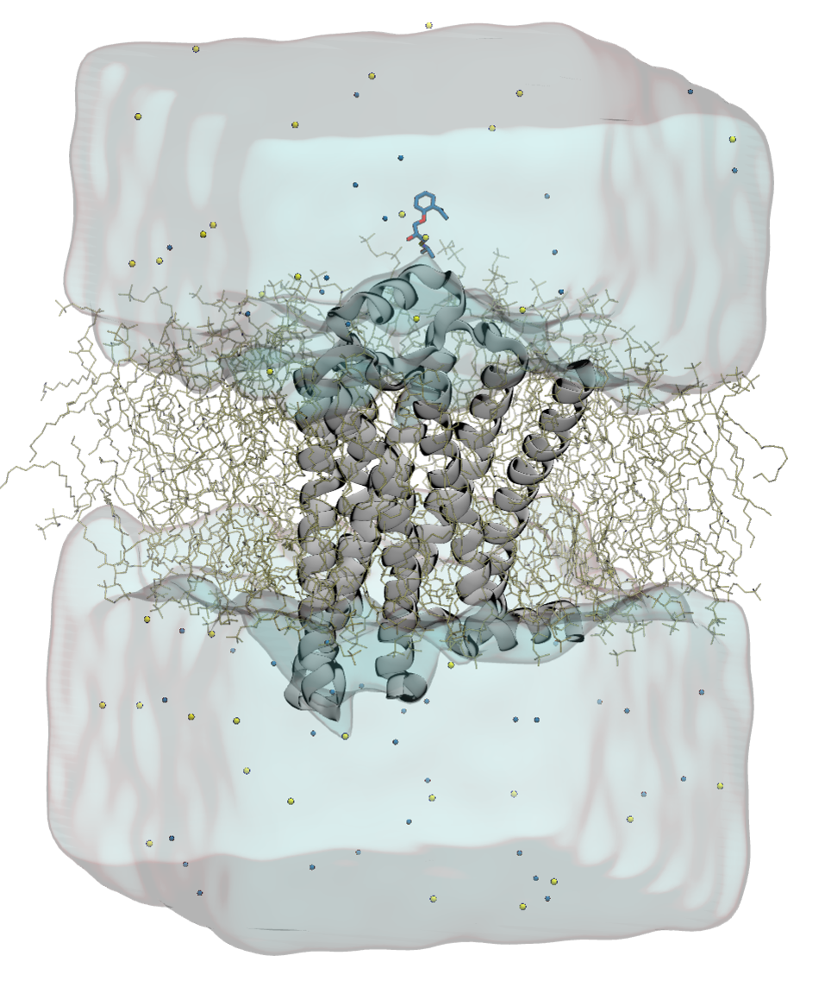

.. Dabble documentation master file, created by
   sphinx-quickstart on Fri Jun 26 11:29:41 2015.
   You can adapt this file completely to your liking, but it should at least
   contain the root `toctree` directive.

Dabble
======

Dabble is a tool for building membrane protein systems. The ultimate goal of the
project is to create an easy to use, one stop tool for system construction and
parameterization.

Dabble includes both the main program dabble.py as well as a powerful API for
building and parameterizing molecular dynamics systems.

To get started via `Anaconda Python <https://www.continuum.io/downloads>`_,
use::

    conda install -c rbetz dabble

Features
--------

- Prepare membrane protein systems by inserting them into a membrane
- Prepare solvated proteins by adding water
- Add ions to neutralize and/or to desired concentration
- Parameterize with AMBER, CHARMM, or GROMACS format parameter sets
- Outputs files for simulation with most major simulation codes
- Automatic detection of post-translational modifications
- Modified amino acids made easy
- Ligands made easy! No more messing with atom names.

Supported Parameter Sets
------------------------

- [X] AMBER
- [X] CHARMM
- [X] OPLS-AA (no lipids)
- [X] Gromacs (no covalent modifications)

Supported Water Models
----------------------

- [X] TIP3
- [X] TIP4P-EW
- [X] SPC/E

Supported Simulation Programs
-----------------------------

- [X] AMBER
- [X] Anton (via conversion)
- [X] CHARMM
- [X] Desmond
- [X] GROMACS
- [X] LAMMPS
- [X] NAMD
- [X] OpenMM
- [X] Any code accepting .psf, .prmtop, or .gro

Citing Dabble
-------------

There is no paper on Dabble yet.
If you use Dabble, please cite it with the following DOI:

    http://doi.org/10.5281/zenodo.836914

Coming soon
-----------

Dabble is under active development. The following features are coming soon:

- Support for covalent modifications in GROMACS
- Lipids with OPLS-AA parameters
- TIP4P-EW waters with CHARMM parameters, in .prmtop format

Contributing
------------

Dabble is a written by Robin Betz.
Bug finding is always appreciated, as well as corner cases where your protein
won't dabble.

Dabble is licensed under the GPLv2 license.

A lot of Dabble is powered by the `VMD Python API <http://www.ks.uiuc.edu/Research/vmd/current/ug/node160.html>`_.

- Source code: https://github.com/drorlab/dabble/
- Issue tracker: https://github.com/drorlab/dabble/issues

API Documentation
-----------------

.. toctree::
   :maxdepth: 2
   :hidden:

   installation
   examples
   command_line
   tutorials
   builder_api
   parameter_api
   utility_programs

* :ref:`search`

